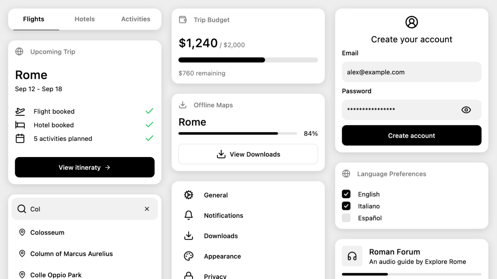

# Composables UI

Composables UI is a collection of modern, fully accessible components for Jetpack Compose and Compose Multiplatform.

## Documentation

Visit [https://composables.com/ui/docs](https://composables.com/ui/docs) to view the full documentation.

## License

Licensed under the [MIT License](LICENSE)
